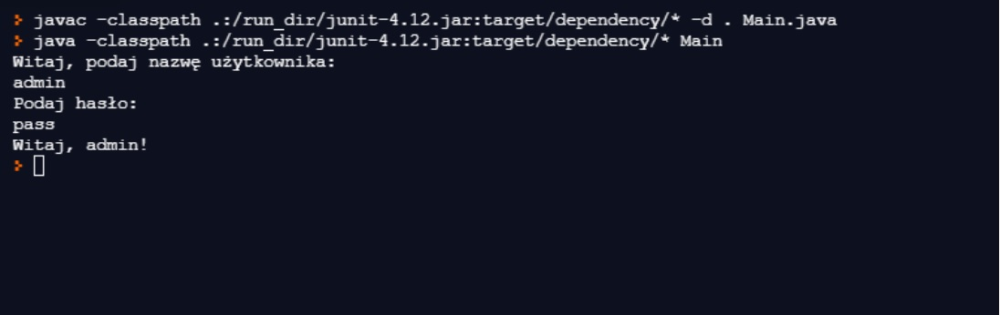

#LoginApp

## Table of contents

- [Overview](#overview)
  - [The challenge](#the-challenge)
  - [Screenshot](#screenshot)
  - [Links](#How-to-use)
- [My process](#my-process)
  - [Built with](#built-with)
  - [What I learned](#what-i-learned)
  

## Overview

### The challenge

Users should be able to:

- Log in 

### Screenshot

### How to use

- You can check how the program works using any IDE for Java

## My process

### Built with

- Java

### What I learned

I learned some basics class managament in Java
